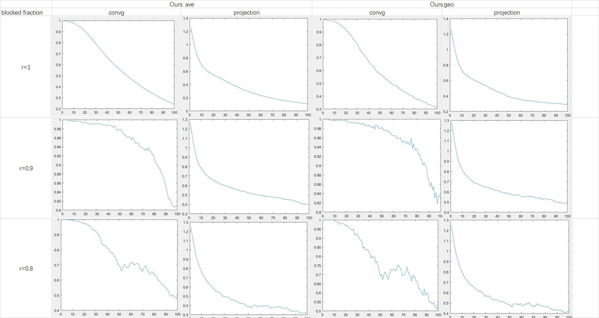

## Documents
- - [x] proposal of experiments of Byzantine PCA
- - [ ] unbalanced Procrustes
	- uccessive Projection (SP) 未完成
- - [x] introduction of DGEP
	- 增加了Lagrangian，同时改变公式顺序，使推导更完整
	-  related work 上下文的逻辑性整理
## Experiments and results
#### SGCCA-求解unbalanced Proctustes问题
已实现：
- [x] EB-zero 
-  [x] EB-eigen

二者在SGCCA上的效果差不多，且EB算法的运行速度比之前的算法更快
#### Byzantine PCA (tentative)
- - [ ] DPCA-multiround
	- multiround+simply averaging
- - [ ] Byzantine PCA-multiround
	- multiround+ trim + median-geometric
	 

## Reading
##### Distributed Robust Learning
- 不同于传统Robust PCA的原问题，数据生成方式是 underlying signal + outliers，感觉依然采用PCA的解法
- setting与Byzantine-robust不同

##### Successive projection method for solving the unbalanced Procrustes problem
- unbalanced Proctustes problems
	- nonconvex problem on Stiefel manifold
	- **unbalanced**： min || A- BQ||_F , A,B不同维 ，相比于balanced的形式没有闭式解 
- algorithms
	- Expansion-Balance (EB)
	- Successive Projection (SP)  (proposed)
		- 目的：跳出**局部最优解**，加了**global correction**
	- Left side relaxation algorithm (LSR)
		- 根据实验结果，LSR精度和以上两种算法差不多但耗时更长，暂时先不予考虑