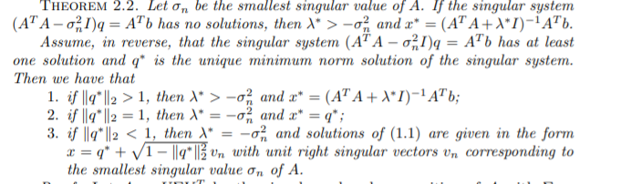

## Documents

## Experiments and results

## Reading
##### 1. A PROJECTION METHOD FOR LEAST SQUARES PROBLEMS WITH A QUADRATIC EQUALITY CONSTRAINT
- 解决LSQE问题，原问题：$min \|Ax-b\|_2~s.t.\|x\|_2=\alpha$
- 
- projection method 

##### 2. A generalized power iteration method for solving quadratic problem on the Stiefel manifold
- 两个问题：
	- : $ max Tr(W^TAW)~s.t. W^TW=I $ $ \rightarrow $ GEP
	- Quadratic problem on the Stiefel manifold(QPSM)：$ min Tr(W^TAW-2W^TB)~s.t. W^TW=I $ 
- 两种算法：
	-  the power method （the dominant eigenvalue） 
	-  the orthogonal iteration method  (dominant eigenvalues)

|  | PM|OI |
| :------:| :------: | :------: |
| QPSM | / | GPI (proposed) |
| GEP | PM | OI |

> <i class="fas fa-lightbulb"></i> 将GPI改为分布式 , $ M=UAV^T, W=UV^T $
> ||one-shot|multir-ound|
> |:---:| :------:| :------: |
> |in the central|average(W_i)| average($ W_i^t $)|
> |error analysis| | |