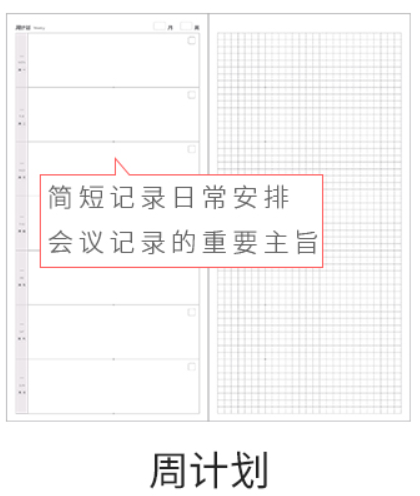
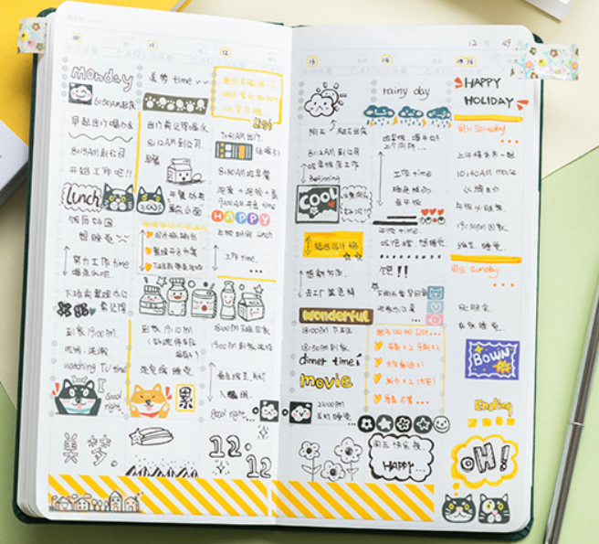
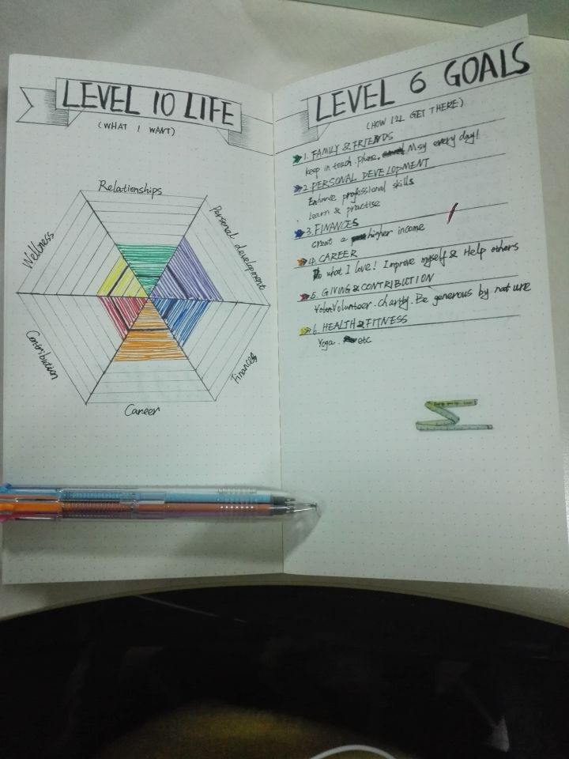

>目的：逐渐找回对生活的掌控感  
>目标：不追求好看的版面和精致的手账册，更注重功能区和坚持度

## 个人感受：
#### 1. 电子手账  
网上有很多电子手账模板，包括在good notes上和notability上的，由于版权意识的加强有些是收费的。  
pros： 可以DIY一些贴纸，涂改画画都很方便。  
cons：不是随时随刻都会用iPad这种电子产品。
####  2. 周计划本
这也是自己目前在用的，灵活性比较大，半DIY
#### 3. 时间轴

pros：安排的好的话可以非常充实和好看，DIY程度看个人本事
cons：时间进度令人感觉到压迫感，如果是每天晚上复盘可能会记不清每个小时在干什么，然后就不想记......

>目前还在用平平无奇的week计划本，想尝试从2021开始同时进行新的全DIY空白手账本

----------

## DIY板块设计参考
### “bullet journal”
[知乎bujo记录](https://zhuanlan.zhihu.com/p/338240126)

以下是我准备采用的模块，划删除线的是有人推荐但是我没有采用的（可以根据自身喜好自己制定）：
- 年计划
	- [Level 10 Life](http://www.bohoberry.com/level-10-life-explained/)
	  
		- Careers improve
			- ...
		- Relationship
			- ...
		- Health
			- ...
		- Finances
			- ...
		- Contribution
			- ...
		- Personal Development
			- ...
	-  OKR:  object + key result
	-  key word: 每月月末回顾，经历
	-  reading list
	
	 
- 月计划
	- schedual: 控制进程
	- honey memory: 小确幸
	- habits tracker 打卡表
	
- 周计划
	- to do list
	- sleep time
	- diet

### 小册子
买过的一些计划本有一些推荐用法。主要是针对weekly计划本这种半DIY的。
- 左边：
	- weekly plan (每一格子代表每个月的某一天)
	- to do list （每个页面代表一天，每个格子代表事项）
	- study notes （每个页面代表学习主题，每个格子代表进一步细分学习内容）
- 右边
	- doodle
	- tracker
	- mind map
	  

----------

2021 新计划本 plan

----------

1.  8 level to life (circle) + OKR（目标+核对） -> 1页
2.  每月关键词（待复盘）-> 2页 + book list（底，待复盘）
   
----------

3.  每月首页：OKR（左）+ （schedual + habit tracker （固定首））（右）
4.  日常页：weekly plan（左）+ mind map（右）